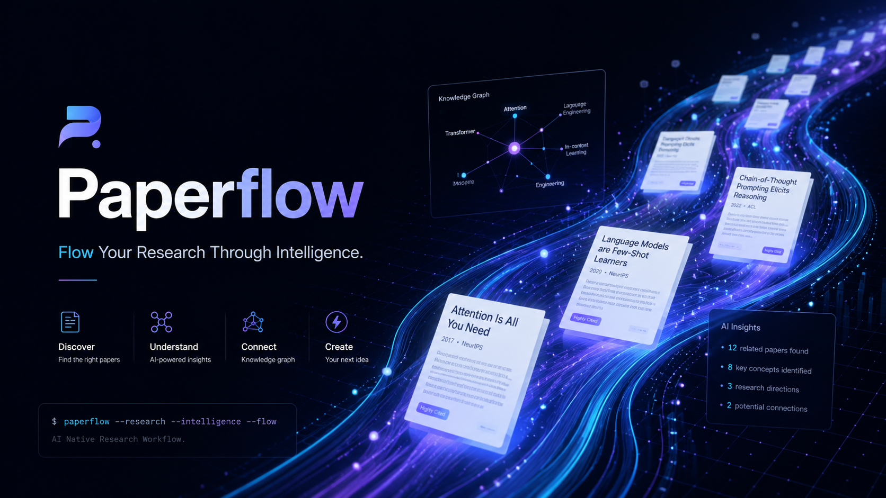

<div align="center">



# Paperflow

**Evidence-first paper reading + citation-aware search + field map + Obsidian knowledge base.**

A local-first paper-reading workbench for AI researchers and engineers.
Powered by DeepSeek-backed agents, every generated claim is graded **R0 / R1 / R2** and traced back to the paper whenever possible.

[English](./README.md) · [中文](./README.zh-CN.md) · [Landing Page](./index.html)

[](./LICENSE)
[](./LICENSE)
[](https://www.python.org/)
[](https://fastapi.tiangolo.com/)
[](https://react.dev/)
[](https://vitejs.dev/)
[](https://obsidian.md/)

</div>

---

## What Is Paperflow

Paperflow turns paper reading into a local-first research workflow:

- Import a PDF or arXiv URL.
- Generate a structured Reading Report instead of a generic summary.
- Inspect every claim through R0 / R1 / R2 reliability labels.
- Jump from claims back to PDF evidence when location data is available.
- Ask a paper-scoped Agent chat grounded in the report, selected evidence, and R1 cache.
- Save the result into an Obsidian-friendly local knowledge base.

The product stance is simple: **report first, chat second, evidence always**.

---

## News

- **2026-05-12 — v0.6 completed.** Report generation now uses a fast briefing → parallel chunk extraction → coordinator synthesis pipeline, reducing wait time while preserving global consistency and evidence grounding.
- **2026-05-12 — v0.5 completed.** The Workspace now supports a high-resolution continuous PDF pane, page jump, zoom controls, evidence-centered scrolling, and a large-screen three-column reading layout.
- **2026-05-12 — v0.4 completed.** Agent chat transcripts are persisted, SSE chat streaming is available, evidence clicks can open the PDF viewer, and Field Map edges now include Agent enrichment metadata.
- **2026-05-12 — v0.3 released.** The Workspace gained a formal right-rail Agent conversation panel with transcript, process cards, status, composer, and paper-scoped chat API.
- **2026-05-12 — v0.2 completed.** Evidence workflow, metadata import, R1 search, Field Map, compare, R2 insights, and task queue support landed.
- **2026-05-12 — Project page added.** A lightweight static landing page is available at [`index.html`](./index.html).

---

## Quickstart

> Requirements: Python 3.9+, Node.js 18+, and a DeepSeek API key for real Agent parsing.

```bash
git clone https://github.com/shiml20/PaperFlow.git
cd PaperFlow

export DEEPSEEK_API_KEY="your-deepseek-api-key"
cd paperflow
./run-dev.sh --install
```

Then open `http://127.0.0.1:5173`, import a PDF or arXiv URL, and open the Workspace.

If dependencies are already installed:

```bash
export DEEPSEEK_API_KEY="your-deepseek-api-key"
cd paperflow
./run-dev.sh
```

---

## How To Use

1. Import a local PDF or paste an arXiv URL.
2. Watch the Agent move from PDF parsing to dynamic partial reports.
3. Read the first key findings while the full report continues to fill in.
4. Open the completed Reading Report and inspect R0 / R1 / R2 claims.
5. Click a claim or evidence item to inspect source text and PDF location.
6. Ask the Agent a focused question grounded in the current paper.
7. Save or update the Obsidian note.

---

## DeepSeek Setup

Paperflow currently supports DeepSeek as the Agent API provider.
The fastest setup is `DEEPSEEK_API_KEY`.

| Variable | Required | Default | Purpose |
| --- | --- | --- | --- |
| `DEEPSEEK_API_KEY` | Yes | none | DeepSeek API key used by the backend PaperAgent. |
| `DEEPSEEK_BASE_URL` | No | `https://api.deepseek.com/beta` | DeepSeek-compatible chat completions endpoint root. |
| `DEEPSEEK_MODEL` | No | `deepseek-v4-flash` | Model used for Reading Report generation. |
| `DEEPSEEK_REPORT_READ_TIMEOUT` | No | `90` | Read timeout in seconds for report generation. |
| `DEEPSEEK_CONFIG_PATH` | No | `~/.deepseek/config.toml` | Alternate config file path. |

Example config file:

```toml
api_key = "your-deepseek-api-key"
base_url = "https://api.deepseek.com/beta"
model = "deepseek-v4-flash"
```

`default_text_model` from older DeepSeek-TUI config files is ignored for Paperflow's report model. This keeps the Paperflow default on `deepseek-v4-flash` unless `DEEPSEEK_MODEL` or `model` is set explicitly.

Without a DeepSeek key, the backend reports `Agent not configured` and cannot produce a real R0/R1 Reading Report.

---

## Manual Run

### Backend

```bash
cd paperflow/backend
python3 -m venv .venv
. .venv/bin/activate
pip install -e '.[dev]'

export DEEPSEEK_API_KEY="your-key"
export DEEPSEEK_MODEL="deepseek-v4-flash"
export DEEPSEEK_REPORT_READ_TIMEOUT="90"

uvicorn app.main:app --reload
```

### Web Frontend

```bash
cd paperflow/frontend
npm install
npm run dev
```

Open `http://localhost:5173`.

### TUI

Paperflow also ships a Textual-based terminal UI that talks to the same backend.

```bash
cd paperflow/backend && . .venv/bin/activate
pip install -e ../tui

paperflow-tui
# or
PAPERFLOW_BASE_URL=http://127.0.0.1:8000 paperflow-tui
# or
python -m paperflow_tui
```

Useful bindings:

| Where | Key | Action |
| --- | --- | --- |
| Library | `i` | Import a local PDF |
| Library | `a` | Import an arXiv URL / ID |
| Library | `o` / `Enter` | Open the selected paper's Workspace |
| Library | `r` | Re-run the PaperAgent |
| Library | `R` | Refresh library + agent status |
| Workspace | `j` / `k` / arrows | Navigate claims |
| Workspace | `Enter` | Inspect evidence |
| Workspace | `a` | Ask a focused R0 / R1 / R2 question |
| Workspace | `1` | Run R1 related-work search |
| Workspace | `2` | Open Field Map |
| Workspace | `s` | Save / update Obsidian note |
| Workspace | `b` / `Esc` | Back to Library |

---

## Core Features

### Dynamic Reading Reports

- **Chunked full-paper reading**: long PDFs are split into bounded chunks instead of being summarized from only the first text window.
- **Dynamic partial reports**: the first completed chunk is saved immediately, so readers can see key findings before the whole paper finishes.
- **Coverage-aware generation**: the UI shows progress such as `覆盖全文 50%`, then `覆盖全文 100% · 8 chunks` when all chunks are covered.
- **Live parsing metrics**: elapsed time keeps ticking while generation is running; tokens, coverage, and chunk count update as new partial reports arrive.
- **Transparent process output**: the Workspace shows PDF text extraction, DeepSeek request preparation, model wait, chunk coverage, report persistence, and failure states.

### Evidence-First Workspace

- R0 / R1 / R2 reliability badges in the UI and data model.
- Evidence quote, page, section, bbox, and `location_status` for claims when available.
- PDF.js reader with page jump, bbox highlight, and select-to-ask.
- Right-side evidence detail panel for selected claims.
- Obsidian-native Markdown export with frontmatter, wikilinks, callouts, and reliability tags.

### Agent Conversation

- A formal right-rail Agent panel with transcript, process cards, status, and composer.
- Chat transcripts are persisted in SQLite and restored when the Workspace opens.
- `/chat` is backed by a DeepSeek chat agent over report + selected evidence + R1 cache, with a report-grounded fallback.
- `/chat/stream` provides SSE step/final events for the frontend.
- Runtime Agent configuration in the web UI: update local DeepSeek API key, switch model, and change report timeout.

### Literature Context And Field Maps

- Metadata import via arXiv, CrossRef, Semantic Scholar, OpenReview, and Zotero.
- Content-hash + DOI + arXiv-ID deduplication.
- Six-lane R1 search: seed, backward, forward, benchmark, survey, and recent.
- Field Map generation: milestones, timeline, task taxonomy, datasets, benchmarks, method families, open problems, trends, and R2 opportunities.
- Agent-enriched Field Map / lineage graph edges with source type, rationale, confidence, and UI labels.
- Multi-paper comparison and R2 research insights with Obsidian export.

---

## Reliability Model

| Level | Meaning | Examples |
| --- | --- | --- |
| **R0** | Strictly grounded in the current paper. Numbers must not be inferred or compared across settings. | "The model is trained on 8xA100 for 72 hours." |
| **R1** | Grounded in another paper / source fetched through external search. Source paper, venue, year, and URL should be recorded. | "This benchmark was introduced in paper X." |
| **R2** | Inference, trend judgement, or research opinion. Always shown with an R2 badge. | "This direction is likely to converge with diffusion priors." |

Reliability is rendered as a UI badge, persisted in JSON, embedded as `#R0` / `#R1` / `#R2` tags in Obsidian notes, and enforced inside the PaperAgent prompt contract.

---

## Architecture

Paperflow ships two front-ends sharing the same backend agent harness:

```text
┌──────────────────────────────┐                ┌──────────────────────────────────┐
│  Web Frontend (React + Vite) │                │  Backend (FastAPI)               │
│  - Library-first home        │ ─── REST ───► │  - PaperStorage (SQLite + files) │
│  - Report-first Workspace    │                │  - PDF parser (PyMuPDF)          │
│  - Agent rail + evidence     │                │  - ReportService                 │
│  - PDF viewer                │                │  - PaperAgent (DeepSeek client)  │
└──────────────────────────────┘                └──────────────┬───────────────────┘
                                                               │
┌──────────────────────────────┐                               │
│  TUI (Textual + httpx)       │ ─── REST ────────────────────►│
│  - Same Library + Workspace  │                               │
│  - R0/R1/R2 badges           │                               │
│  - Keyboard-driven           │                               │
└──────────────────────────────┘                               ▼
                                                 ┌──────────────────────────┐
                                                 │  Local Data              │
                                                 │  - PDFs                  │
                                                 │  - report JSON           │
                                                 │  - Obsidian vault notes  │
                                                 │  - SQLite metadata       │
                                                 └──────────────────────────┘
```

The agent harness lives only in the backend. Both the web frontend and the TUI are thin HTTP clients.

**Tech stack:** Python 3.9+ · FastAPI · Pydantic · PyMuPDF · httpx · pytest · React · TypeScript · Vite · Vitest · Textual · Rich · SQLite · DeepSeek API.

---

## Data And Schema

User data is stored under `paperflow/backend/paperflow_data/` and is git-ignored by default.

Every R0 claim follows this shape:

```json
{
  "id": "claim-id",
  "text": "中文解释 / English explanation",
  "reliability": "R0",
  "evidence": [
    {
      "source": "paper.pdf",
      "quote": "verbatim quote from the PDF",
      "page": 3,
      "section": "Method",
      "bbox": null,
      "location_status": "page_and_quote"
    }
  ],
  "uncertainty": null
}
```

A full Reading Report covers paper metadata, executive summary, task, dataset, benchmark/metric, method, model scale, input/output, compute/training, key results, strengths, limitations, related-work claims, and an evidence index.

---

## Repository Layout

```text
PaperFlow/
├── README.md
├── README.zh-CN.md
├── index.html
├── LICENSE
├── assets/
│   ├── README.html                       ← GitHub Pages-friendly README
│   ├── favicon.svg
│   └── paperflow_banner.png
├── design_docs/                         ← local design / PRD notes
└── paperflow/
    ├── run-dev.sh                       ← starts backend + frontend
    ├── backend/                         ← FastAPI + PaperAgent harness
    ├── frontend/                        ← React + Vite + TypeScript web client
    └── tui/                             ← Textual terminal client
```

---

## Testing

```bash
# Backend
cd paperflow/backend
. .venv/bin/activate
pytest -q

# Frontend
cd ../frontend
npm test
npm run build

# TUI
cd ../tui
pytest -q
```

---

## Contributing

Paperflow is early, but the reliability contract is stable. Good first contributions:

- Improve PDF parsing fidelity for sections, tables, references, and equations.
- Add stronger evidence-location checks and PDF highlighting.
- Extend the Obsidian renderer for Field Maps, R2 callouts, and citation graph links.
- Add end-to-end tests for import -> report -> Agent chat -> Obsidian export.

Please keep PRs aligned with the reliability contract: every UI surface that produces a fact should be expressible as R0 / R1 / R2 with evidence.

---

## License

Paperflow is released under the [**PolyForm Noncommercial License 1.0.0**](./LICENSE).

- You may freely use, copy, modify, and distribute Paperflow for noncommercial purposes.
- You may not use Paperflow for commercial purposes without a separate commercial license.
- Forks and derivative works must keep this license and the `Required Notice` line in [`LICENSE`](./LICENSE).
- The software is provided as is, without warranty of any kind.

For commercial use, please open an issue on the [GitHub repository](https://github.com/shiml20/PaperFlow) to discuss a commercial license.

Copyright © 2026 shiml20 and Paperflow contributors.

---

## Acknowledgements

- Agent integration is built against the DeepSeek API and reuses configuration written by the DeepSeek-TUI CLI when present.
- PDF parsing is powered by [PyMuPDF](https://github.com/pymupdf/PyMuPDF).
- The frontend is built with [Vite](https://vitejs.dev/) and [React](https://react.dev/).
- The prompt design was inspired by Peng Sida's open research-learning notes, [pengsida/learning_research](https://github.com/pengsida/learning_research).

If Paperflow is useful to your research workflow, a star is the kindest signal.

---

## Status

Paperflow currently ships two front-ends on top of the same backend agent harness:

- **Web**: React + Vite + TypeScript, report-first Workspace, PDF viewer, Agent rail, and Obsidian export.
- **TUI**: Textual + httpx, keyboard-driven Library / Workspace / R0-R1-R2 / Evidence / Q&A flow.

### v0.1

- [x] Library-first home with status tracking (`queued` -> `processing` -> `completed` / `failed`)
- [x] DeepSeek-backed PaperAgent generating R0 Reading Reports
- [x] R0 / R1 / R2 reliability badges in UI and data model
- [x] Evidence quote, page, and section per claim
- [x] Background agent task with persistent reports
- [x] Obsidian-native paper note export
- [x] Focused Q&A around dataset / benchmark / method / compute / limitations

### v0.2

- [x] **Evidence Workflow**: PyMuPDF block parser, evidence verification, PDF.js page jump, bbox highlight, and select-to-ask.
- [x] **Metadata & Import**: arXiv, CrossRef, Semantic Scholar, OpenReview, Zotero, and DOI/arXiv/content-hash deduplication.
- [x] **Real R1 Search**: six-lane related-work search over Semantic Scholar, OpenAlex fallback, Papers with Code, and local references.
- [x] **Field Map**: milestones, timeline, task taxonomy, datasets, benchmarks, method families, open problems, trends, and R2 opportunities.
- [x] **Compare + R2 + Task Queue**: multi-paper compare, research insights, Field Map Obsidian export, cancel/retry/resume task APIs.

### v0.3

- [x] Formal Agent Conversation rail replacing the old focused Q&A area.
- [x] Paper-scoped chat API: `POST /api/papers/{paper_id}/chat`.
- [x] Evidence-aware chat inputs: selected claim, evidence, page, quote, and section.
- [x] Right-rail information architecture for Agent status, config, evidence, chat, and Obsidian export.

### v0.4

- [x] Chunked full-paper Reading Reports over bounded DeepSeek chunks.
- [x] Dynamic partial reports so the first key findings appear before full completion.
- [x] Coverage-aware UI such as `覆盖全文 50%` and `覆盖全文 100% · 8 chunks`.
- [x] Live parsing metrics while generation is still running.
- [x] Transparent Agent progress for extraction, request preparation, model wait, coverage, and persistence.
- [x] Runtime Agent configuration for local API key, model, and report timeout.
- [x] Persist Agent chat threads in SQLite and restore the latest transcript when the Workspace opens.
- [x] Upgrade chat answers to a DeepSeek-backed chat agent over report + selected evidence + R1 cache, with a report-grounded fallback.
- [x] Surface report and chat work through the task lifecycle; report import/rerun now runs through the task queue wrapper and chat records completed task snapshots.
- [x] Add SSE streaming for Agent chat step/final events, with frontend stream consumption and final transcript sync.
- [x] Deepen PDF evidence interactions: evidence detail can open the PDF viewer, jump to the evidence page, and reuse bbox highlights when available.
- [x] Add Agent-enriched Field Map / lineage graph edges with source type, rationale, confidence, and UI labels that distinguish Agent suggestions from rule-derived relations.

### v0.5

- [x] Render PDF pages at device-pixel-ratio resolution so text stays sharp on Retina and large displays.
- [x] Add continuous PDF scrolling with toolbar controls for direct page jump and zoom presets (`Fit`, `100%`, `125%`, `150%`).
- [x] Move the PDF into an independent Workspace pane that becomes a left column on large screens.
- [x] Keep evidence-driven PDF opening: clicking evidence opens the PDF pane, jumps to the page, and scrolls the highlight into view when bbox data exists.

### v0.6

- [x] Replace serial full-report generation with a staged Agent pipeline: fast paper briefing, parallel chunk extraction, coordinator deduplication, and final synthesis.
- [x] Share the same paper briefing with every chunk agent so parallel extraction stays globally consistent and avoids repeated claims.
- [x] Preserve partial reports during extraction while the final coordinator pass merges duplicates, fills missing required sections conservatively, and keeps exact evidence quotes.
- [x] Add richer generation status messages for briefing, parallel chunk extraction, per-chunk completion, and coordinator synthesis.
